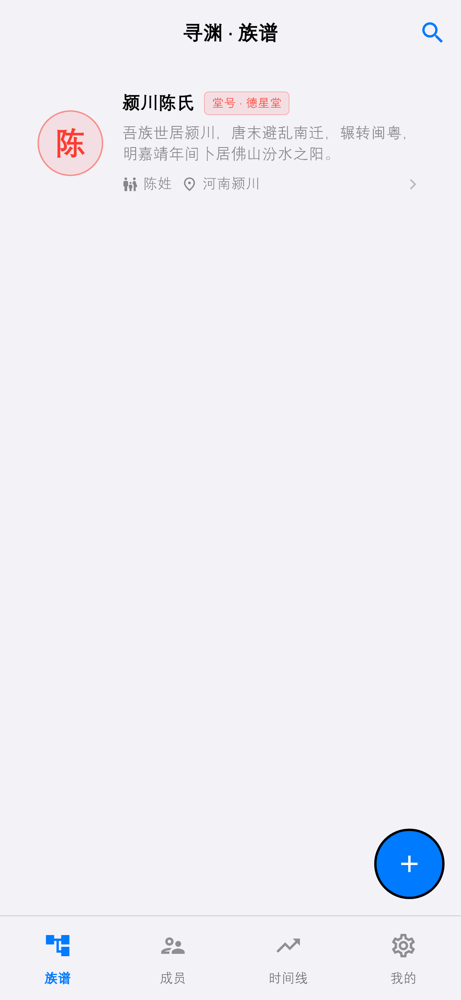
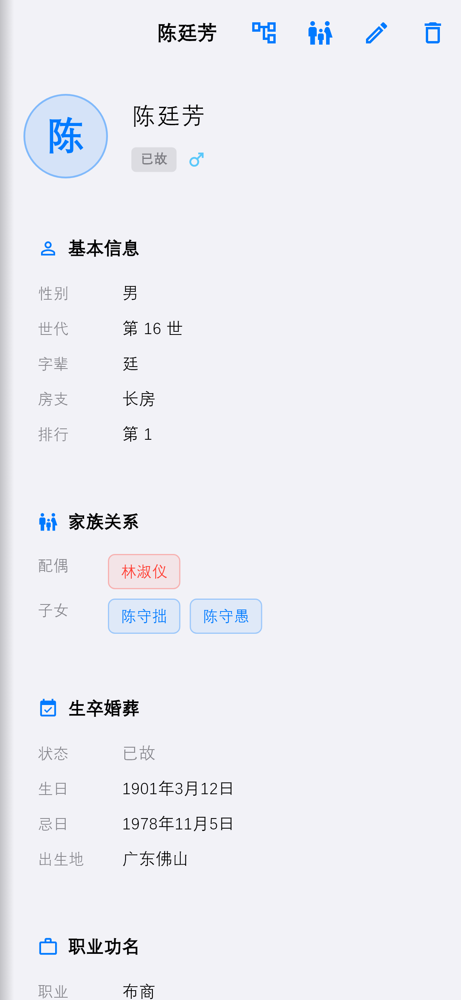
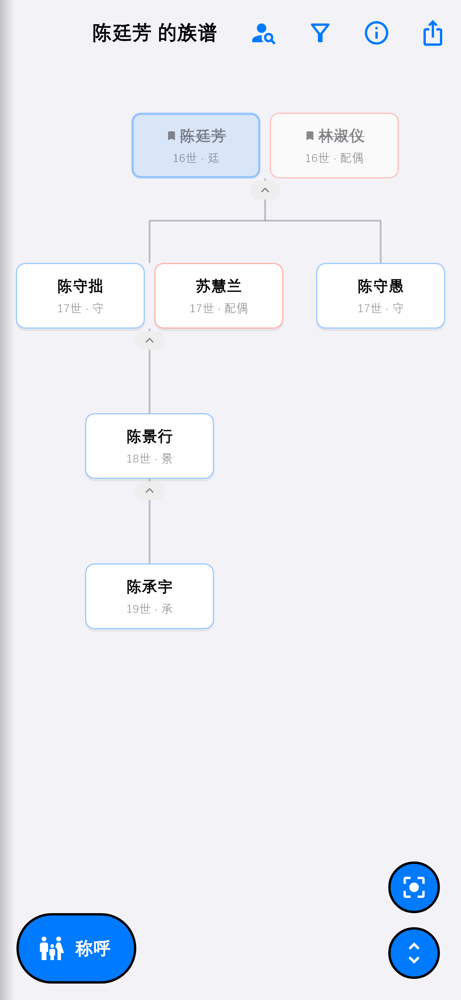
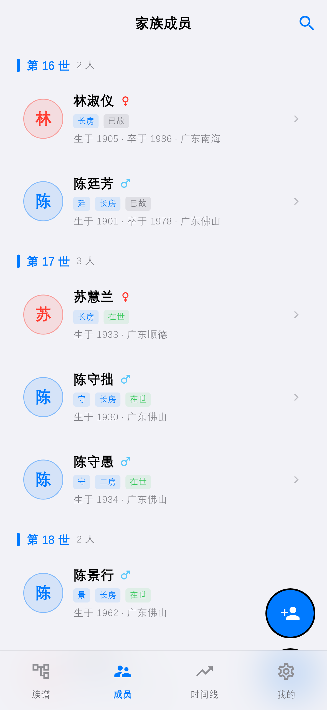
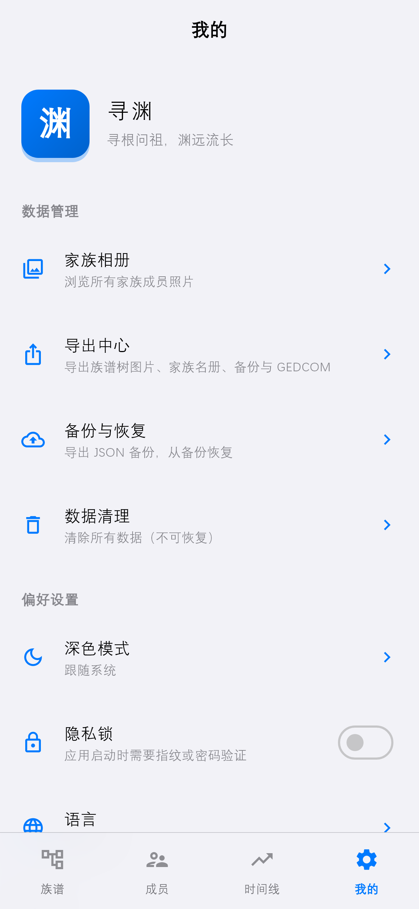
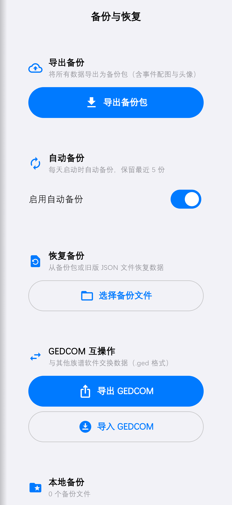

# 寻渊 · XunYuan

> 寻根问祖，渊远流长

本地优先、离线可用的中文族谱 / 家谱应用。用 Flutter 编写，**所有数据只保存在你的手机本地**——不联网、不上传、无埋点。

## 界面预览

| 族谱 | 家族首页 | 人物详情 | 谱系图 |
| --- | --- | --- | --- |
|  |  |  |  |

| 成员 | 事件时间线 | 我的 | 备份与恢复 |
| --- | --- | --- | --- |
|  |  |  |  |

> 截图中的家族数据均为虚构演示数据；生成方式见 `test/screenshot_capture_test.dart`。

## 功能

### 家族与成员

- 多家族管理，支持堂号、郡望、字辈诗
- 成员档案：姓 / 名 / 字 / 号、性别、世次、字辈、支系、排行、生卒日期、生卒葬地、职业、头衔、头像
- 家族简介与人物生平支持**图文混排**（记事本式编辑，图片在正文中就位插入与删除）

### 关系与世系

- 亲属关系：父 / 母 / 配偶 / 子女 / 兄弟姐妹 / 养父 / 养母
- 族谱树可视化：缩放平移、切换中心人物、按姓名与字号定位成员
- 关系循环检测

### 事件与媒体

- 事件类型：出生 / 结婚 / 去世 / 迁徙 / 功名 / 其他，事件描述支持配图
- 家族事件时间线
- 家族相册（图片 / 视频 / 音频 / 文档）

### 数据与安全

- **备份与恢复**：备份为 zip 包，内含全部数据与图片，换机恢复不丢图；支持每日自动备份（保留最近 5 份）
- **GEDCOM 5.5 导入导出**，可与其他族谱软件互通
- 导出族谱树为 PNG / PDF，可直接分享
- **隐私锁**（指纹 / 密码），开启后禁止截屏与任务切换器预览
- 深色模式、简体中文 / English

## 隐私

**所有数据仅保存在你的手机本地。** 应用**未申请 `INTERNET` 权限**——不是"承诺不上传"，而是在系统层面就没有联网能力，可自行在仓库中核验。无账号、无统计、无广告、无崩溃上报。

应用仅声明以下权限：

| 权限 | 用途 |
| --- | --- |
| `USE_BIOMETRIC` / `USE_FINGERPRINT` | 隐私锁解锁 |

相机与相册**不需要额外权限**：均通过系统相机、系统照片选择器按需调用，只处理你当次选中的图片，不会扫描整个相册。

备份、GEDCOM、PDF 等文件全部由你主动导出，保存位置与分享对象由你决定，应用不会自动外传。

完整说明见[隐私政策](docs/privacy-policy.md)。

## 下载

前往本仓库的 [Releases](../../releases) 页面下载最新 APK。构建产物不放入源码仓库。

- 包名：`com.xunyuan.familytree`
- 最低 Android 6.0（API 23），目标 Android 14（API 34）

## 开发

```bash
flutter pub get
flutter run          # 调试运行
flutter test         # 运行测试
flutter analyze      # 静态分析

# 出包：按 ABI 拆成两个 APK —— 新机 arm64-v8a、32 位老机 armeabi-v7a
flutter build apk --release --split-per-abi --target-platform android-arm64,android-arm
```

产物在 `build/app/outputs/flutter-apk/`：

- `app-arm64-v8a-release.apk` —— 现役机型用
- `app-armeabi-v7a-release.apk` —— 32 位老机用（arm64 机器装它也能跑，拿不准就发这个）

两个包都自带 `libapp.so` + `libflutter.so`，缺任一即为构建参数写错。

release 签名读取 `android/key.properties`（**不在版本控制中**），该文件缺失时自动回退 debug 签名。

## 技术栈

- Flutter 3.24.x + Dart 3.5
- Material 3，S1（Apple Design Mind）视觉体系：品牌蓝 `#0062CC` + 中性灰阶，卡片 16 圆角、无水波纹、按压位移反馈
- Riverpod 状态管理 · go_router 路由（`StatefulShellRoute.indexedStack`，四个 Tab 各自保留导航与滚动状态）
- Drift + SQLite 本地数据库
- share_plus · image_picker · file_picker · pdf · local_auth · archive

## 文档

- [隐私政策（中英双语）](docs/privacy-policy.md)
- [上架文案与素材清单](docs/store-listing.md)
- [更新日志](CHANGELOG.md)

## 许可

[MIT](LICENSE)
